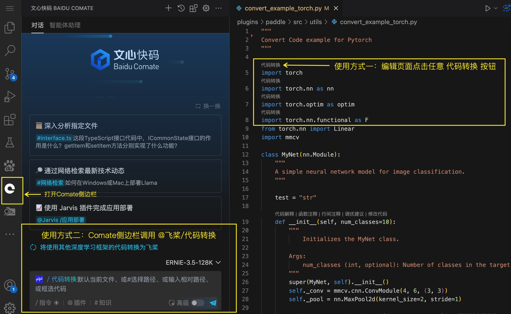

# 代码自动转换工具

   

**Pa**ddlePaddle Code **Convert** Toolkits（**[PaConvert Github](https://github.com/PaddlePaddle/PaConvert)**）

##  🤗 公告 🤗
- 本工具由 Paddle 官方团队维护与建设，所有转换代码均已经过测试，欢迎使用，高效迁移 Pytorch 代码到 PaddlePaddle

- 支持 1500+个 Pytorch API 的一键转换，我们通过 300+个 Pytorch 模型测试，代码行数的自动转换率约为 **95+%**（剩余 5%工作需要您手动修改）

- 本工具基于 [PyTorch 最新 release 与 Paddle develop API 映射表](https://www.paddlepaddle.org.cn/documentation/docs/zh/develop/guides/model_convert/convert_from_pytorch/pytorch_api_mapping_cn.html) 实现，表中 API 均经过详细验证分析，欢迎查阅

- 有使用问题和建议欢迎在 [PaConvert GitHub Issues](https://github.com/PaddlePaddle/PaConvert/issues) 中提出

## 概述

本工具能自动将其它深度学习框架训练或推理的**代码**，转换为 PaddlePaddle 的**代码**，方便快速自动地 **模型代码迁移**。

目前仅支持自动转换 Pytorch 代码，其它深度学习框架的支持后续新增中，转换时会尽量保持原代码的风格与结构，将其它深度学习框架的 API 接口 转换为 PaddlePaddle 的 API 接口。

转换过程中不会改动原文件，会将原项目中的文件一一转换到 `out_dir` 文件夹中（如不指定`out_dir`，则默认在当前目录下新建`paddle_project/`）。

## 使用方式

### 1. IDE 交互式用法（推荐）

在 IDE 中交互式编程使用，界面友好，使用门槛低。

需要在`PyCharm`或`VS Code`等主流 IDE 中安装 **文心快码插件(Baidu Comate)** 后即可使用。以`VS Code`上使用为例：




### 2. 命令行用法

通过终端命令行的方式使用，有一定的使用门槛：

```bash
pip install -U paconvert
paconvert --in_dir torch_project [--out_dir paddle_project] [--exclude_dirs exclude_dirs] [--log_dir log_dir] [--log_level "INFO"] [--run_check] [--no-format]
```

- 命令行参数介绍

```
--in_dir        输入 torch 项目文件，可以为单个文件或文件夹
--out_dir       可选，输出 paddle 项目文件，可以为单个文件或文件夹，默认在当前目录下创建./paddle_project/
--exclude_dirs  可选，排除转换的文件或文件夹，排除多项时请用逗号分隔，默认不排除
--log_dir       可选，输出日志的路径，默认会在终端上打印日志
--log_level     可选，打印 log 等级，支持"WARNING"、"INFO"、"DEBUG"，默认"INFO"
--run_check     可选，工具自检
--no-format     可选，不格式化转换后的代码。使用此选项时，转换后的 Paddle 代码不进行代码格式化处理
```


## 转换示例

以下面一个简单的 Pytorch Demo 代码为例：

#### 转换前
```
import torch
import torch.nn as nn
import torch.optim as optim
import torch.nn.functional as F
from torch.nn import Linear
import mmcv

class MyNet(nn.Module):
    test = "str"

    def __init__(self, num_classes=10):
        super(MyNet, self).__init__()
        self._conv = mmcv.cnn.ConvModule(4, 6, (3, 3))
        self._pool = nn.MaxPool2d(kernel_size=2, stride=1)

        self._fc1 = torch.nn.Linear(6 * 25 * 25, 120)  # 假设输入图像为 28x28，通过卷积和池化后尺寸变为 25x25
        self._fc2 = nn.Linear(120, out_features=84)
        self._fc3 = Linear(in_features=84, out_features=num_classes)

    def forward(self, x):
        x = self._conv(x)
        x = self._pool(x)

        x = self._fc1(torch.flatten(x, 1))
        x = self._fc2(x)
        x = self._fc3(x)
        y = torch.add(x, x)
        return y

net = MyNet()
sgd = optim.SGD(net.parameters(), lr=0.01)
lr = optim.lr_scheduler.MultiStepLR(sgd, milestones=[2, 4, 6], gamma=0.8)

for i in range(10):
    x = torch.rand(8, 4, 28, 28)
    out = net(x).sum()

    sgd.zero_grad()
    out.backward()
    sgd.step()

```

#### 转换后
```
import paddle


class MyNet(paddle.nn.Layer):
    test = "str"

    def __init__(self, num_classes=10):
        super(MyNet, self).__init__()
>>>>>>        self._conv = mmcv.cnn.ConvModule(4, 6, (3, 3))
        self._pool = paddle.nn.MaxPool2D(kernel_size=2, stride=1)
        self._fc1 = paddle.nn.Linear(in_features=6 * 25 * 25, out_features=120)
        self._fc2 = paddle.nn.Linear(in_features=120, out_features=84)
        self._fc3 = paddle.nn.Linear(in_features=84, out_features=num_classes)

    def forward(self, x):
        x = self._conv(x)
        x = self._pool(x)
        x = self._fc1(paddle.flatten(x=x, start_axis=1))
        x = self._fc2(x)
        x = self._fc3(x)
        y = paddle.add(x=x, y=paddle.to_tensor(x))
        return y


net = MyNet()
sgd = paddle.optimizer.SGD(
    parameters=net.parameters(), learning_rate=0.01, weight_decay=0.0
)
tmp_lr = paddle.optimizer.lr.MultiStepDecay(
    milestones=[2, 4, 6], gamma=0.8, learning_rate=sgd.get_lr()
)
sgd.set_lr_scheduler(tmp_lr)
lr = tmp_lr
for i in range(10):
    x = paddle.rand(shape=[8, 4, 28, 28])
    out = net(x).sum()
    sgd.clear_gradients(set_to_zero=False)
    out.backward()
    sgd.step()

```

#### 日志打印

在转换过程中，终端打印信息如下：

```text
===========================================
PyTorch to Paddle Convert Start ------>:
===========================================
Start convert file: /workspace/PaConvert/test.py --> /workspace/PaConvert/paddle_project/test.py
[test.py:1] remove 'import torch'
[test.py:2] remove 'import torch.nn as nn'
[test.py:3] remove 'import torch.optim as optim'
[test.py:4] remove 'import torch.nn.functional as F'
[test.py:5] remove 'from torch.nn import Linear'
[test.py:6] remove 'import mmcv'
[test.py] add 'import paddle' in line 1
[test.py:1] [Success] Convert torch.nn.Module to Paddle
[test.py:13] [Not Support] convert mmcv.cnn.ConvModule to Paddle is not supported currently
[test.py:14] [Success] Convert torch.nn.MaxPool2d to Paddle
[test.py:16] [Success] Convert torch.nn.Linear to Paddle
[test.py:17] [Success] Convert torch.nn.Linear to Paddle
[test.py:18] [Success] Convert torch.nn.Linear to Paddle
[test.py:24] [Success] Convert torch.flatten to Paddle
[test.py:27] [Success] Convert torch.add to Paddle
[test.py:31] [Success] Convert Class Method: torch.nn.Module.parameters to Paddle
[test.py:31] [Success] Convert torch.optim.SGD to Paddle
[test.py:32] [Success] Convert torch.optim.lr_scheduler.MultiStepLR to Paddle
[test.py:35] [Success] Convert torch.rand to Paddle
[test.py:36] [Success] Convert Class Method: torch.Tensor.sum to Paddle
[test.py:38] [Success] Convert Class Method: torch.nn.Module.zero_grad to Paddle
[test.py:39] [Success] Convert Class Method: torch.Tensor.backward to Paddle
[test.py:40] [Success] Convert Class Method: torch.optim.Optimizer.step to Paddle, just remain the same
Finish convert /workspace/PaConvert/test.py --> /workspace/PaConvert/paddle_project/test.py


===========================================
Convert Summary
===========================================
There are 16 Pytorch APIs in this Project:
 15  Pytorch APIs have been converted to Paddle successfully!
 1  Pytorch APIs are not supported to convert to Paddle currently!
 Convert Rate is: 93.75%

For these 1 Pytorch APIs that currently do not support to convert, which have been marked by >>> before the line,
please refer to [https://www.paddlepaddle.org.cn/documentation/docs/zh/develop/guides/model_convert/convert_from_pytorch/pytorch_api_mapping_cn.html]
and convert it by yourself manually. In addition, these APIs will be supported in future.

Thank you to use Paddle Code Convert Tool. You can make any suggestions
to us by submitting issues to [https://github.com/PaddlePaddle/PaConvert].

****************************************************************
______      _____                          _
| ___ \    / ____|                        | |
| |_/ /_ _| |     ___  _ ____   _____ _ __| |_
|  __/ _  | |    / _ \| \_ \ \ / / _ \ \__| __|
| | | (_| | |___| (_) | | | \ V /  __/ |  | |_
\_|  \__,_|\_____\___/|_| |_|\_/ \___|_|   \__|

***************************************************************
```

转换完成后，会打印 **转换总结** ，包含 **总 API 数、成功转换 API 数、不支持转换 API 数、转换率** 。例如，上述代码里一共有 16 个 Pytorch API（含基于 Pytorch 的第三方库 API 例如 mmcv），其中 15 个被成功转换，仅 1 个不支持转换，因此转换率为 `93.75%` 。

- **对于成功转换的 API**：代码风格会略有变化，会 **补全 API 全名、补全参数关键字、移除注释** 。因为代码在扫描识别的过程中，**注释** 无法识别，会被移除。

- **对于不支持转换的 API**：将 **补全为 Pytorch API 全名**，同时在行前通过 `>>>>>>` 的形式加以标记，用户需要对该 API 进行人工手动转换，然后删除 `>>>>>>` 标记，否则代码无法运行。


## 案例实践

以下大语言模型代码库已经支持一键 100%转换率，欢迎学习与交流：

| 模型名                                                     | Pytorch 代码库地址                 | 支持类型   |
| ----------------------------------------------------------| ------------------------------ | -------- |
| [Llama](https://github.com/PaddlePaddle/PaConvert/blob/master/docs/TypicalCase_Llama.md)   | https://github.com/meta-llama/llama.git  | 推理 |
| [Qwen](https://github.com/PaddlePaddle/PaConvert/blob/master/docs/TypicalCase_Qwen.md)     | https://huggingface.co/Qwen/Qwen-7B-Chat  | 推理 |


## 贡献代码

代码自动转换工具（[PaConvert](https://github.com/PaddlePaddle/PaConvert)）为开源贡献形式，欢迎向我们贡献代码，详细开发步骤请参考 [贡献代码教程](docs/CONTRIBUTING.md)
